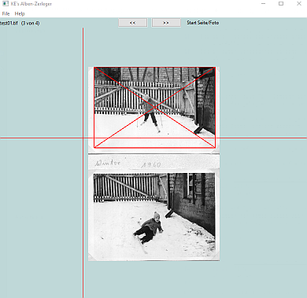
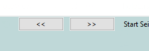
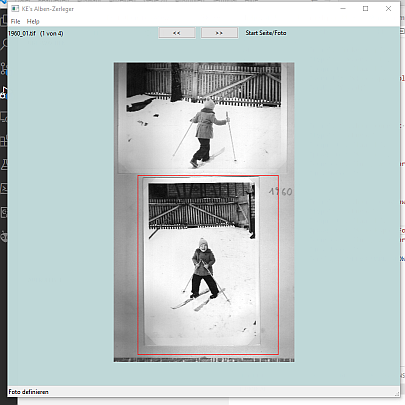
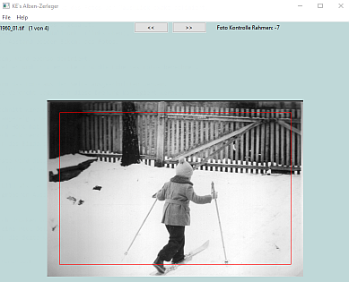
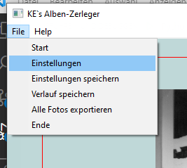
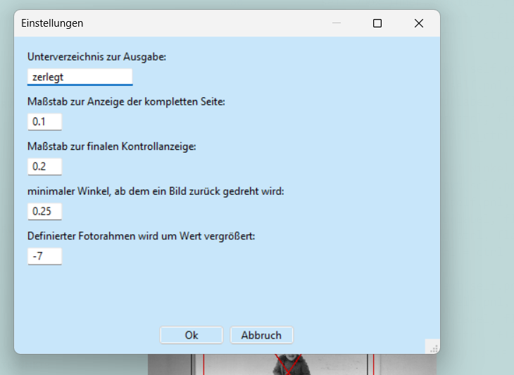

======
Zweck
======

Dient zum Extrahieren einzelner Fotos aus Scan's kompletter Seiten eines Foto-Albums.

Der Ablauf wird vom Programm vorgegeben.

Gesamtablauf
==============

Arbeitsverzeichnis festlegen
----------------------------

Beim Programmstart wird zuerst das Arbeitsverzeichnis festgelegt.
Dazu wählt  das Program zunächst das zuletzt benutzte Verzeichnis.
Exisitiert dieses nicht mehr oder finden sich dort keine Tiff-Dateien, erfolgt eine Meldung an den Beutzer.

Dieser kann mit der Maus ein Verzeichnis auf die Programmoberfläche ziehen (Drag & Drop)
oder das Verzeichnis per Menu auswählen.  **ToDo: programmieren**.

Durch die Festlegung des Arbeitsverzeichnis beginnt die Bearbeitung der ersten gescannten Seite dieses Verzeichnisses.
Bei einem Wechsel des Arbeitsverzeichnisses wird die Bearbeitung des aktuellen Verzeichnisses abgebrochen 
und ebenfalls mit der ersten Seite des neuen Verzeichnis neu begonnen.
Die im alten Verzeichnis bereits fertig definierten Fotos, werden vorher in einer Datei gesichert,
so daß die Bearbeitung später fortgeführt werden kann. **ToDo: checken bzw programmieren**.

Bearbeitung des Arbeitsverzeichnisses
--------------------------------------

Zuerst werden alle Tiff-Dateien eingelesen. Exisitiert eine Datei mit den Daten bereits definierter Fotos, so wird diese eingelesen.

Die erste Seite (Datei) wird angezeigt.
Wurde die Seite verdreht gescannt, kann sie um 90° gedreht werden (Taste 'r') 
und korrigiert gespeichert werden (Taste 's').

Die schon festgelegten Fotos werden durch rote Rahmen mit Diagonalen gekennzeichnet.

Es folgt die Definition der Lage eines oder mehrerer Fotos (s. **xxx**).

Die Bearbeitung der Seite wird durch den Wechsel auf eine andere Seite abgebrochen.
Hierzu dienen die beiden Buttons, die auf die nächste oder vorhergehende Seite wechseln.

Dies kann erfolgen, wenn alle Fotos definiert wurden, aber auch vorher.

Erfolgt der Wechsel mitten in der Definition eines Fotos, so wird diese verworfen.
Das gilt ebenso beim Wechsel des Arbeitsverzeichnisses 
oder bei einem gewünschten Abbruch mittels 'ESC'-Taste.

Die Information vollständig definierter Fotos bleibt dagegen beim Wechsel oder Abbruch erhalten.
Sie werden durch rote, durchkreuzte Rahmen auf der Seite markiert.

Fotodefinition
===============

Grobrahmen
----------

Zur Definition der Lage eines Fotos wird zunächst ein grober Rahmen um das Foto gelegt.

Durch den ersten Klick ins Bild wird die linke obere Ecke des Rahmens definiert.
Der zweite Klick definiert die rechte untere Ecke.
Dieser Rahmen muss das zu extrahierende Foto grob umgeben.

Anstatt einem Klick mit der linken Maustaste kann auch die Leertaste gedrückt werden.
Die Mausposition kann mit den Pfeil-Tasten geändert werden.

Ecken
------

Der Rahmen dient zur Grobdefinition der Lage des Fotos auf der Seite.
Es wird nun ein vergrößerter Ausschnitt der Seite gezeigt, 
der die linke oberen Ecke des Rahmens umgibt.

In diesem Ausschnitt wird die linke obere Ecke des Fotos per Mausklick exakt definiert.

Analog wird die rechte obere Ecke des Fotos angewählt.
Aus diesen beiden Ecken ergeben sich der Nullpunkt (links oben),
die Drehlage und die Breite (Abstand beider Ecken) des Fotos.

Die dritte Ecke, rechts unten, wird ebenso definiert.
Aus dem Abstand zwischen zweiter und dritter Ecke wird die Höhe des Fotos berechnet.

Mit diesen Informationen wird das Foto aus der Seite ausgeschnitten.
Falls das Foto auf der Seite verdreht lag, wird diese Drehung korrigiert.

Beschnitt
---------

Dieser korrigierte Bildausschnitt wird mit einem umgebenden Rand dargestellt.
Es wird ein rotes Rechteck angezeigt, welches durch Ecke 1 geht 
und die ermittelte Breite und Höhe hat.
Der Anwender kann dieses Rechteck verkleinern oder vergrößern (Strg-'+' oder Strd-'-')
und so eine letzte Korrektur des Bildausschnitts vornehmen.

Durch Mausklick oder Leertaste wird diese Korrektur abgeschlossen
und das so definierte Foto wird in als Tiff-Datei im Ausgabeverzeichnis gespeichert.
Das Ausgabeverzeichnis ist standardmäßig das Unterverzeichnis *zerlegt* des Arbeitsverzeichnisses.
Die Einstellung kann aber im Einstellungsmenu geändert werden.

Weiterhin wird ein Kontrollbild als JPG gespeichert. 
Dieses enthält einen etwas größeren Ausschnitt und den finalen roten Rahmen,
der das Tiff definiert.

Der gesamte Ablauf kann durch drücken von 'ESC' abgebrochen werden.
Das Programm erwartet dann eine neue Definiton eines Fotos.
Alternativ kann der Anwender die Seite wechseln.

Foto löschen
--------------

Die definierten Fotos werden auf den Seiten durch Rahmen mit diagonalen Linien markiert.
Durch Drücken der Taste 'e' (entfernen) wird die Definition des Fotos, 
in dem der Cursor steht, gelöscht. Evtl bereits exportierte Fotos bleiben erhalten.
Das Foto kann neu definiert und neu exportiert werden.

Foto-Beschnitt ändern
----------------------

Fällt bei den bereits gespeicherten Tiffs auf, das der Beschnitt zu groß (oder zu klein) gewählt wurde,
kann dieser nachträglich noch einmal geändert werden.

Hierzu kann die fehlerhafte Tiff-Datei auf das Programm gezogen werden (Drag&Drop) **Geht nicht**
oder die Seite, aus der das Tiff ausgeschnitten wurde, wird aufgerufen und die Maus in das durchkreuzte Viereck
des Fotos gesetzt. Durch Strg-s wird das Foto zum Korrigieren des Beschnitts angeboten **link zu beschnitt**.

Einstellungen
==============

Einstellungen können über einen Dialog, der per Menü "Datei/Einstellungen" aufgerufen wird, geändert werden.
Alle Änderungen gelten aber nur für eine Arbeitssitzung, wenn sie nicht per "Datei/Einstellungen" gespeichert wurden.

Tastenbelegung
================

.. list-table:: 
   :widths: 10 10 80
   :header-rows: 1

   * - Taste
     - Modifiz.
     - Funktion
   * - num +
     - 
     - zoomt Bild um Faktor 2
   * - num -
     - 
     - zoomt Bild um Faktor 0,5
   * - num +
     - Strg
     - vergrößert den Rahmen zur Definition eines Fotos um x Pixel
   * - num -
     - Strg
     - verkleinert den Rahmen zur Definition eines Fotos um 5 Pixel
   * - Pfeiltasten
     - 
     - verschieben den Cursor
   * - Pfeiltasten
     - Strg
     - verschieben das Bild
   * - e
     - 
     - entfernt eine Definition eines Fotos von einer Seite
   * - Space
     - 
     - wie Mausklick (geht auf nächsten Bearbeitungsschritt mit akt Cursorposition)
   * - r
     - 
     - Dreht Seitendarstellung um 90°
   * - s
     - 
     - Speichert Seitendarstellung (nach Drehen)
   * - s
     - Strg
     - Foto neu beschneiden
   * - ESC
     - 
     - Bricht Fotodefinition ab.
